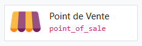
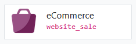
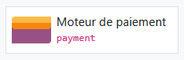
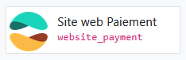
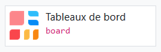

# 🛠️ Modules Odoo necessaires / conseillés

Plusieurs modules pré-existant seront indispensables à l'implementation de Odoo Community.  

## 💼 Socle de base : Produits, Stock et Achats

Le coeur du système, indispensable aux bases du business de Juliette, Dylan et Mattéo

* Inventaire (stock)  

    * Gérer les CD comme articles uniques avec gestion des caractéristiques (état, édition, ... )
    * Emplacement physique du stock (Étagère A, B, C du garage).

* Achats (purchase)  

    * Formaliser l’acquisition des lots (vide-greniers, Leboncoin, particuliers ...)
    * Suivre le coût d’acquisition réel pour calculer la marge
    

## 🧑‍🤝‍🧑 Clients : Contacts, fidélisation et réclamations 

* Contacts (contacts)  

    * Centraliser l'annuaire de tous les acteurs du business (acheteurs, vendeurs de lots, fournisseurs de fournitures).

* Marketing par courriel (mass_mailing)  

    * Concevoir et envoyer des emails graphiques à votre base de contacts pour les informer ou proposer des promotions

* Projet (project)  

    * Suivre sous forme de tâches les emails et questions des clients

## 🛒 Canaux de Vente : Terrain et Web

* Point de Vente (point_of_sale)  

    * Interface de vente ("Caisse enregistreuse"), accessible sur tablette/telephone, pour les marchés et vide-greniers.

* Vente en ligne (website + website_sale)  
 
    * Boutique en ligne proposant le catalogue des CD et de leurs caracteristiques, mis à jour en temps réel
    * Gestion des clients et des achats 

* Paiements en ligne (payment + website_payment)  
 
    * Lien avec les passerelles de paiements en ligne (Stripe, PayPal, virement ...)

* Ventes (sale_management)  

    * Gestion du cycle de vente et des frais de ports
    * Indispensable pour la vente en ligne (panier validé devient commande à livrer)
 
* Connecteur Multi-canal (connector + sale-channel)  
    * Module externe (OCA) pour lier Odoo à Vinted, eBay ou Discogs et centraliser les commandes provenant de plateformes, sans saisie manuelle

## 📊 Pilotage et administration : Facturation,  Tableaux de Bord

Partie cruciale pour la transparance dans l'équipe et la légalité fiscale.

* Comptabilité simplifiée française (l10n_fr)  

    * Configuration de la TVA à 0% (les micro-entreprises ne collectent généralement pas la TVA au début)

* Facturation (account)  

    * Génération des factures web et des rapports de vente
    * Automatise la création du "Livre des recettes" (obligation légale en micro-entreprise) et simplifie le calcul du CA brut pour les déclarations URSSAF

* Tableaux de Bord (board)  

    * Visualisation des performances.
    * Création de graphiques sur mesure pour suivre la rentabilité réelle et la répartition des bénéfices

## 🎨 Ergonomie & Design

* "Web Responsive" (OCA) 
    * Module externe (OCA) qui remplace le menu classique par une icône "App Drawer" de la version entreprise
 

